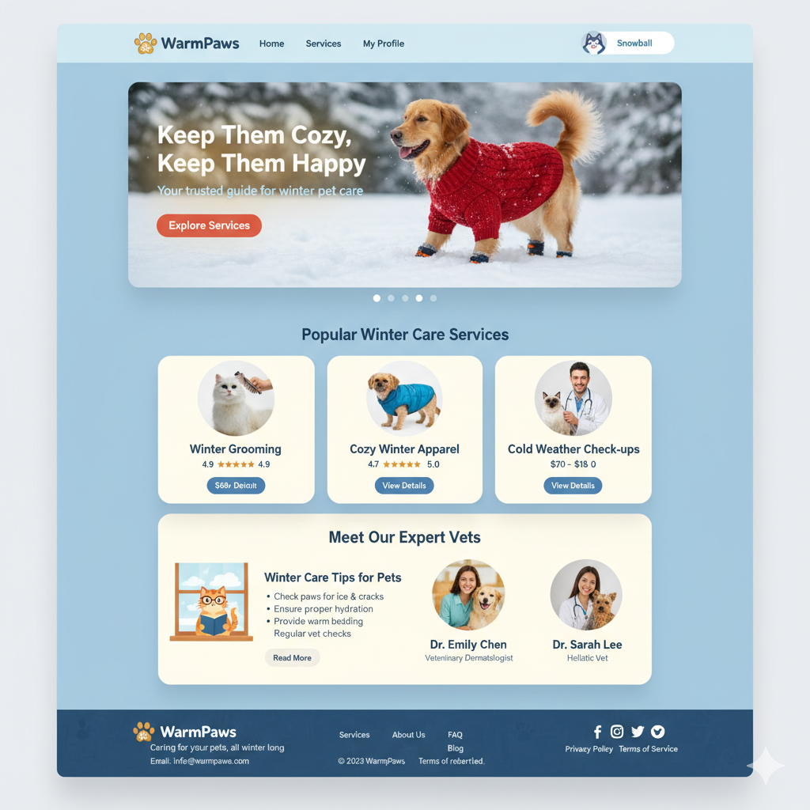
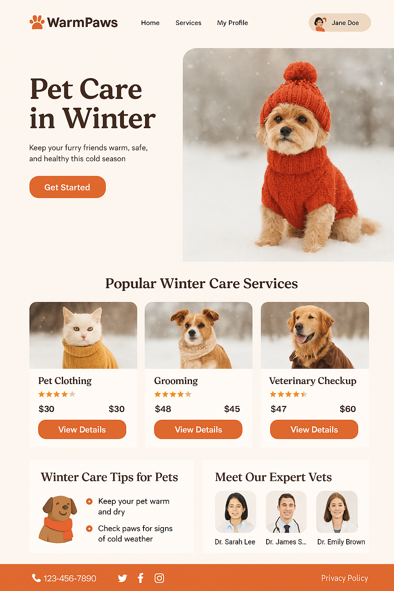
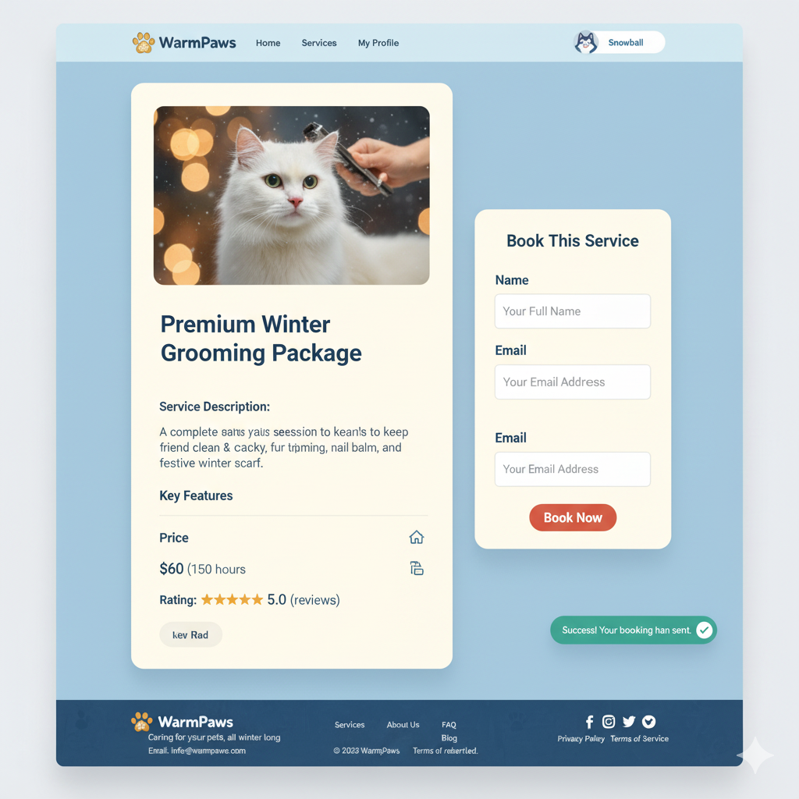
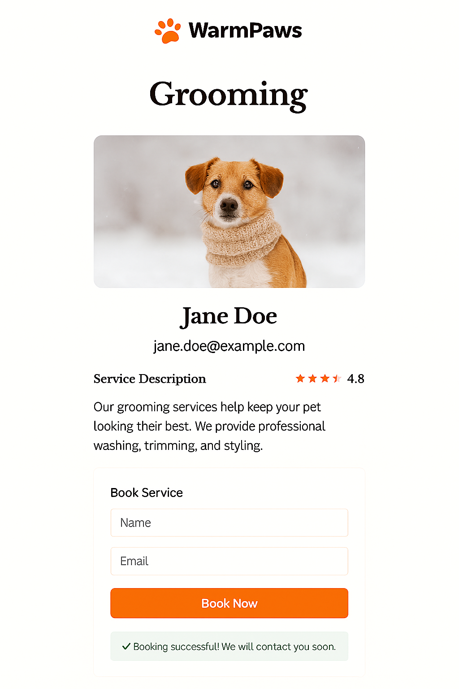
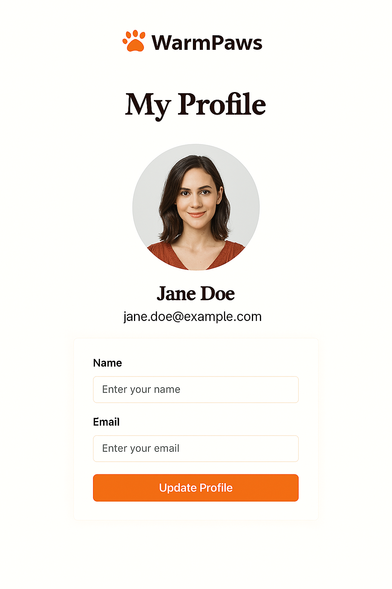
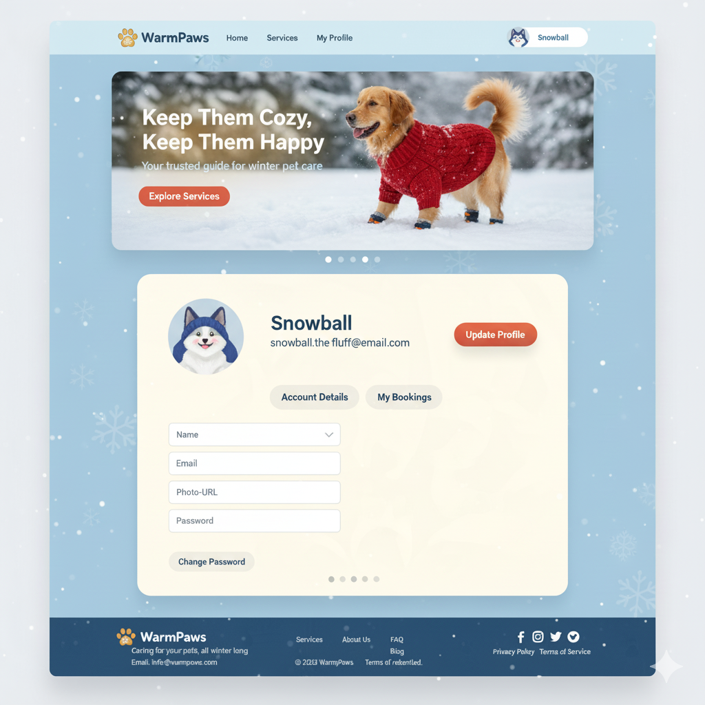
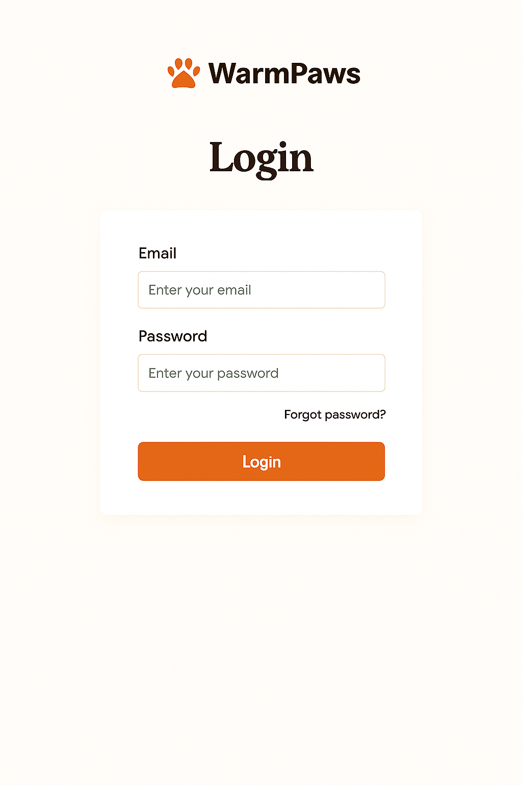
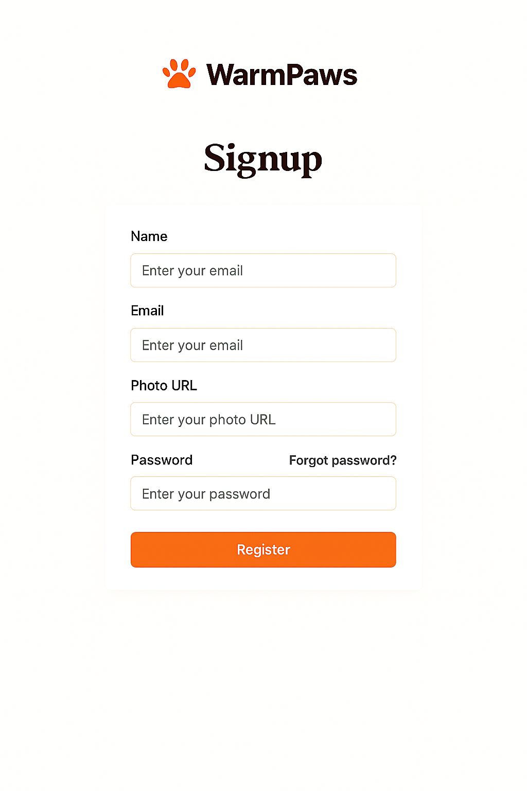
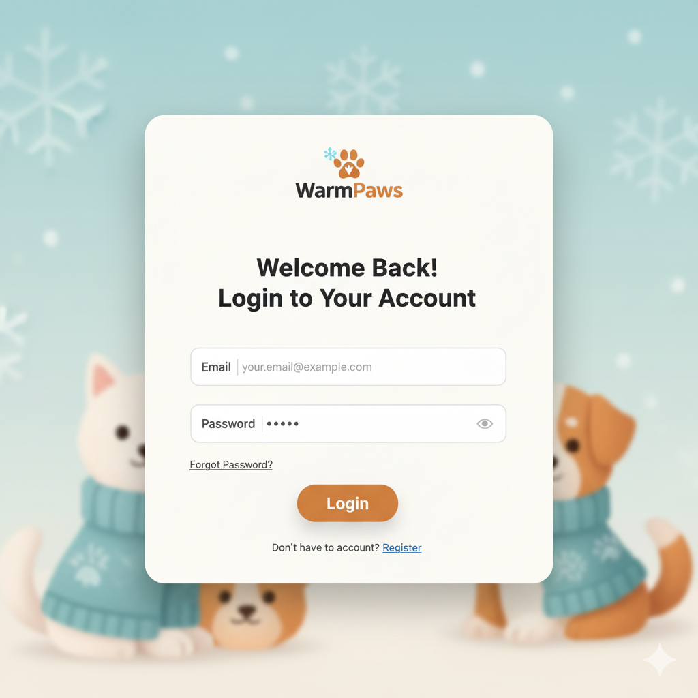
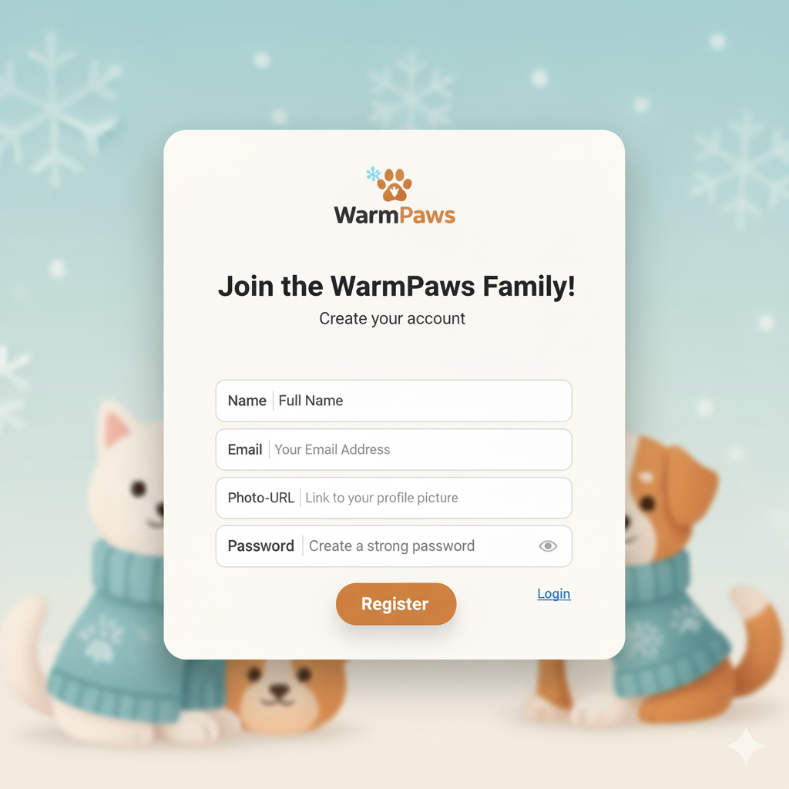

# 

A cozy winter companion platform designed for pet owners to ensure their furry friends stay warm, safe, and healthy during the cold season. Users can explore local pet care services, winter pet clothing, grooming options, and expert tips — all in one friendly interface.

### Base URL

The base URL for the API is:
[https://openapi.programming-hero.com/api](https://openapi.programming-hero.com/api)

### Endpoints

1. **Get All News Categories**

   - **URL**: `/news/categories`
   - **Full URL**: https://openapi.programming-hero.com/api/news/categories
   - **Method**: `GET`
   - **Description**: Retrieves a list of all available news categories.

2. **Get All News in a Category**

   - **URL Format**: `/news/category/{category_id}`
   - **Full URL Example**: https://openapi.programming-hero.com/api/news/category/01
   - **Method**: `GET`
   - **Description**: Retrieves all news articles within a specified category.
   - **Path Parameter**:
     - `category_id` (string): The unique ID of the category.

3. **Get News Detail by ID**
   - **URL Format**: `/news/{news_id}`
   - **Full URL Example**: https://openapi.programming-hero.com/api/news/0282e0e58a5c404fbd15261f11c2ab6a
   - **Method**: `GET`
   - **Description**: Retrieves detailed information about a specific news article.
   - **Path Parameter**:
     - `news_id` (string): The unique ID of the news article.

## Layouts & Design

There will be three layour for the project. watch below designs to understand layout structure/

### News Layout

 
 
 
 

### Pet-Details Layout

 
 

### Porfile Layout

 
 <!--  -->
 <!--  -->
 

### Auth Layout

<table>
 <tr>
   <td> </td>
   <td> </td>
 </tr> 
 <!-- <tr>
   <td> </td>
   <td> </td>
 </tr>  -->
 <tr>
   <td> </td>
   <td> </td>
 </tr> 
</table>
